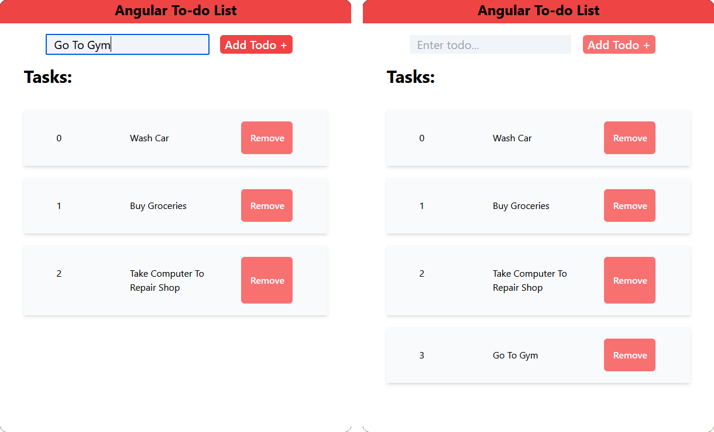
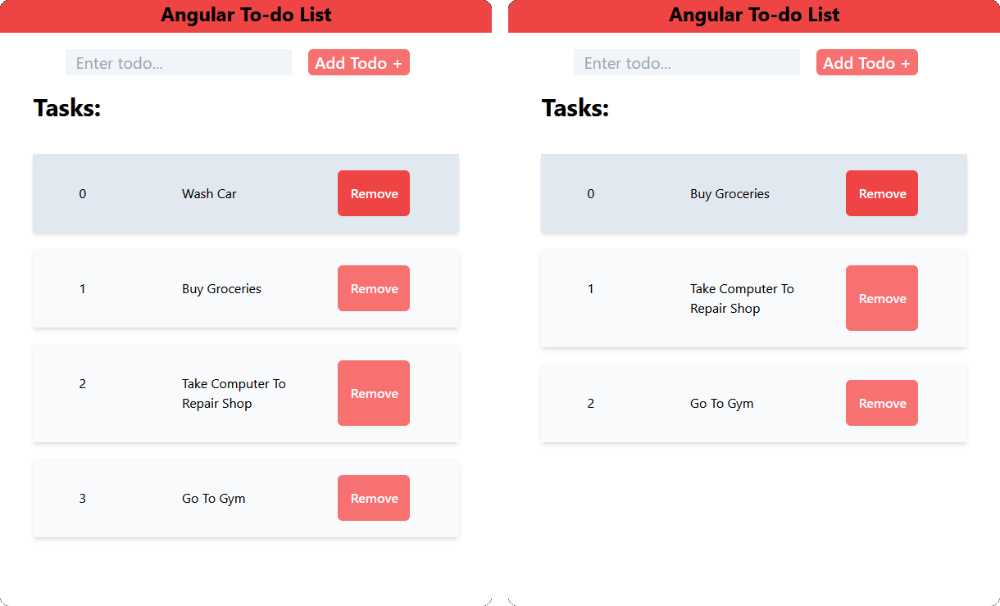

# Angular To-Do List

Simple To-do List Application made in Angular and Tailwind CSS

Try it! https://melyespinofl96.github.io/Angular-To-do-List/

## Add Tasks To The List

You can add a task by typing it in the text box then clicking the Add Todo + button

## Delete Tasks

Delete a task by clicking the remove button next to the task you want to remove

